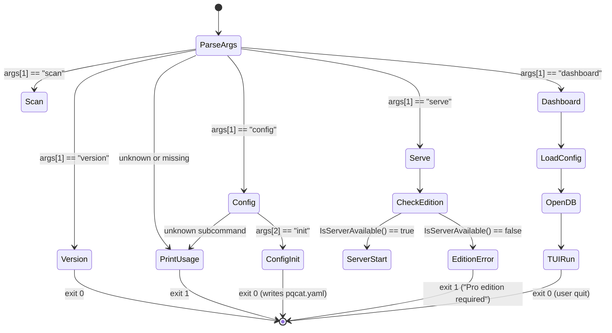
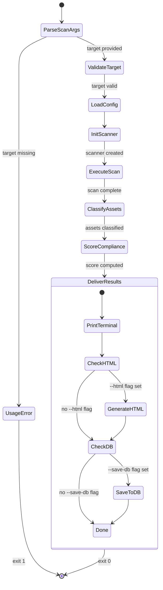
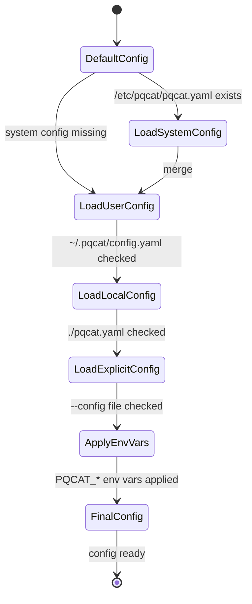
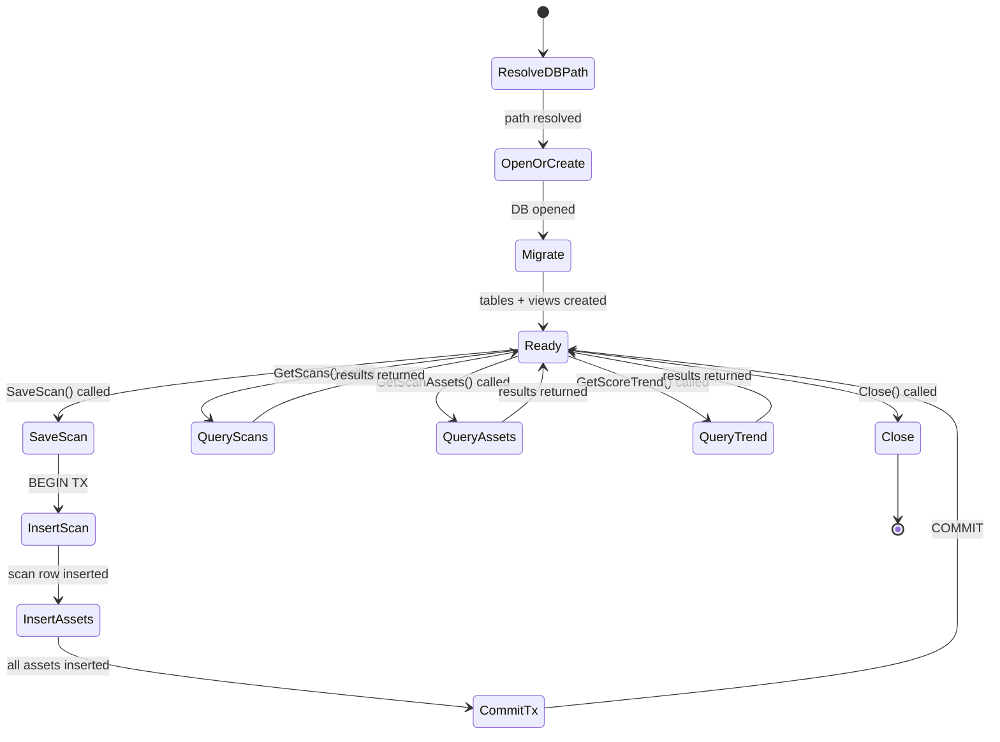
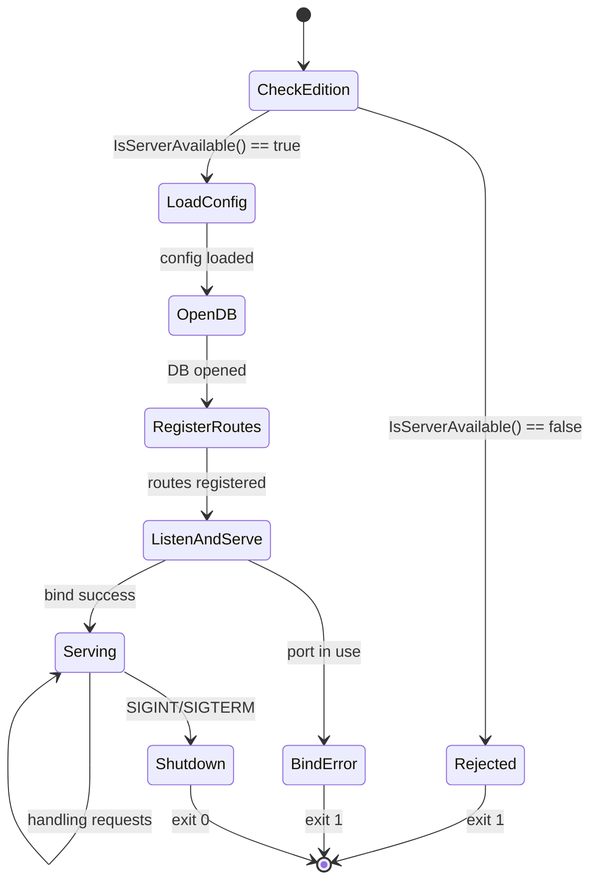

# PQCAT Standard Operations Procedure

**Document ID:** PQCAT-SOP-001  
**Version:** 1.0  
**Classification:** UNCLASSIFIED // FOUO  
**Date:** March 5, 2026  
**Author:** Soqucoin Labs Inc.  
**Point of Contact:** labs@soqu.org  

---

## 1. Purpose

This Standard Operations Procedure (SOP) defines the installation, configuration, operation, maintenance, and troubleshooting procedures for **PQCAT** (Post-Quantum Cryptography Compliance Assessment Tool), both the open-source scanner and the proprietary compliance engine. This document serves as the authoritative operational reference for all PQCAT deployments.

## 2. Scope

This SOP applies to:

- **PQCAT Enclave** (air-gapped edition): Federal default for SCIF, IL4/IL5, and classified environments.
- **PQCAT Pro** (connected edition): Enterprise edition for FedRAMP cloud and NIPR environments.

Both editions are built from the same codebase using Go build tags. The Enclave edition contains zero outbound network code beyond scan targets. The Pro edition adds a REST API, embedded web dashboard, and live threat intelligence feed.

## 3. References

| Reference | Description |
|---|---|
| NIST SP 800-131A Rev. 2 | Transitioning the Use of Cryptographic Algorithms and Key Lengths |
| NSM-10 (Jan 2022) | National Security Memorandum on Improving Cybersecurity of National Security Systems |
| CNSA 2.0 (Sep 2022) | NSA's Commercial National Security Algorithm Suite 2.0 |
| CISA PQC Guidance (2024) | Post-Quantum Cryptography Readiness for Federal Agencies |
| NIST FIPS 203/204/205 | ML-KEM, ML-DSA, SLH-DSA Standards |
| NIST SP 800-53 Rev. 5 | Security and Privacy Controls for Information Systems |
| CycloneDX 1.5 | OWASP Software Bill of Materials Standard |

## 4. Definitions

| Term | Definition |
|---|---|
| **PQCAT** | Post-Quantum Cryptography Compliance Assessment Tool |
| **Enclave** | Air-gapped edition with no TCP listeners and no network dependencies |
| **Pro** | Connected edition with REST API, web dashboard, and live threat intelligence |
| **CBOH** | Crypto Bill of Health — the branded 1-page scored assessment report |
| **POA&M** | Plan of Action and Milestones — federal compliance tracking artifact |
| **Zone** | Classification band: RED (quantum-vulnerable), YELLOW (transitional), GREEN (CNSA 2.0 compliant) |
| **Sidecar** | A JSON file containing threat intelligence data, deployed alongside the binary |

## 5. System Architecture

### 5.1 Three-Layer Design

```
┌──────────────────────────────────────────────────┐
│  DISCOVERY LAYER         [Open Source, Apache 2.0] │
│  TLS · SSH · SBOM · PKI · Code · HSM · SCAP      │
│  CIDR Range · Aggregate Scan                       │
├──────────────────────────────────────────────────┤
│  INTELLIGENCE LAYER      [Proprietary]             │
│  Compliance Engine · Scoring · Threat Intel        │
│  Config Loader · SQLite Persistence                │
├──────────────────────────────────────────────────┤
│  DELIVERY LAYER                                    │
│  PDF · HTML · JSON · SIEM · TUI · REST API         │
└──────────────────────────────────────────────────┘
```

### 5.2 Edition Comparison

| Capability | Enclave | Pro |
|---|---|---|
| CLI scanner (9 modules) | ✓ | ✓ |
| TUI terminal dashboard | ✓ | ✓ |
| Self-contained HTML reports | ✓ | ✓ |
| SQLite scan history & POA&M | ✓ | ✓ |
| YAML configuration | ✓ | ✓ |
| PDF/JSON/ATO export | ✓ | ✓ |
| TCP listeners | ✗ | ✓ |
| REST API (localhost:8443) | ✗ | ✓ |
| Embedded web dashboard | ✗ | ✓ |
| Live threat intelligence feed | ✗ | ✓ |
| Auto-update from sidecar | ✗ | ✓ |

### 5.3 Open-Core Model

| Component | License | Repository |
|---|---|---|
| Scanner modules (9) | Apache 2.0 | `github.com/soqucoin-labs/pqcat` (public) |
| Algorithm classifier | Apache 2.0 | `github.com/soqucoin-labs/pqcat` (public) |
| Data models | Apache 2.0 | `github.com/soqucoin-labs/pqcat` (public) |
| Config loader | Apache 2.0 | `github.com/soqucoin-labs/pqcat` (public) |
| Compliance engine | Proprietary | `github.com/soqucoin-labs/pqcat-engine` (private) |
| Scoring engine | Proprietary | `github.com/soqucoin-labs/pqcat-engine` (private) |
| Report generators | Proprietary | `github.com/soqucoin-labs/pqcat-engine` (private) |
| REST API & dashboard | Proprietary | `github.com/soqucoin-labs/pqcat-engine` (private) |

## 6. Installation

### 6.1 System Requirements

| Requirement | Minimum | Recommended |
|---|---|---|
| Operating System | Linux x86_64 or ARM64, macOS, Windows | Linux x86_64 |
| Memory | 128 MB | 512 MB |
| Storage | 50 MB (binary + DB) | 500 MB (with scan history) |
| Runtime dependencies | None | None |
| Network (Enclave) | Access to scan targets only | — |
| Network (Pro) | Scan targets + threat intel feed | TLS to feed endpoint |

### 6.2 Binary Installation

```bash
# Download release binary (example for Linux x86_64)
curl -LO https://releases.soqucoin.com/pqcat/v1.0.0/pqcat-linux-amd64
chmod +x pqcat-linux-amd64
mv pqcat-linux-amd64 /usr/local/bin/pqcat

# Verify integrity
sha256sum -c SHA256SUMS

# Verify version
pqcat version
```

### 6.3 Build from Source

```bash
# Clone repository
git clone https://github.com/soqucoin-labs/pqcat.git
cd pqcat

# Build Enclave edition (air-gapped, no server code)
make airgap

# Build Pro edition (with REST API + web dashboard)
make pro

# Build both editions
make all

# Run tests
make test
```

### 6.4 Cross-Platform Builds

```bash
make linux-amd64    # Linux x86_64 (common federal server)
make linux-arm64    # Linux ARM64
make windows-amd64  # Windows x86_64
make release        # All platforms + SBOM + checksums
```

### 6.5 Air-Gap Deployment

For classified or disconnected environments:

1. Build the binary on a connected workstation: `make airgap`
2. Generate SHA-256 checksum: `make checksums`
3. Transfer `pqcat` binary and `SHA256SUMS` to target via approved media
4. Verify checksum on target: `sha256sum -c SHA256SUMS`
5. Place binary in `/usr/local/bin/` or equivalent PATH location
6. No additional runtime files, libraries, or configuration are required

## 7. Configuration

### 7.1 Configuration Precedence

PQCAT uses a 6-level configuration precedence chain (highest to lowest):

1. **CLI flags** (`--framework fisma`, `--html report.html`)
2. **Environment variables** (`PQCAT_FRAMEWORK=fisma`)
3. **Explicit config** (`--config /path/to/pqcat.yaml`)
4. **Local directory** (`./pqcat.yaml`)
5. **User home** (`~/.pqcat/config.yaml`)
6. **System** (`/etc/pqcat/pqcat.yaml`)

### 7.2 Generate Configuration Template

```bash
pqcat config init
# Creates pqcat.yaml with documented defaults in the current directory
```

### 7.3 Configuration File Reference

```yaml
# PQCAT Configuration — pqcat.yaml
# Full reference: https://soqucoin.com/pqcat/docs/config

# Organization identity
organization: "Sample Agency"
environment: "production"            # production | staging | development

# Compliance framework (determines urgency multipliers and deadlines)
framework: "fisma"                   # fisma | fedramp | dod | nist | cnsa | custom

# Criticality overrides (target-specific risk weighting)
criticality:
  "*.treasury.gov": "critical"       # Glob patterns supported
  "*.internal.mil": "high"
  "mail-gw-*": "critical"

# SIEM integration
siem:
  format: "splunk"                   # splunk | elk | cef | json
  endpoint: "https://splunk.agency.gov:8088/services/collector"
  token: "${PQCAT_SIEM_TOKEN}"       # Environment variable reference

# Threat intelligence (Pro edition only)
intel:
  sidecar: "pqcat-intel.json"        # Local sidecar file path
  feed_url: "https://intel.soqucoin.com/v1/pqcat"
  auto_update: true

# Scan policy
scan_policy:
  tls_ports: [443, 8443, 636, 993, 995]
  ssh_ports: [22, 2222]
  exclude_subnets: ["10.0.0.0/8"]
  exclude_hosts: ["localhost", "*.test"]
  max_scan_time: "30m"

# Database (scan history)
database:
  path: "pqcat.db"                   # SQLite file path

# Server (Pro edition only)
server:
  listen: ":8443"
  tls: true
  cert_file: "/etc/pqcat/tls/cert.pem"
  key_file: "/etc/pqcat/tls/key.pem"
```

### 7.4 Environment Variables

All configuration fields can be overridden via `PQCAT_` prefixed environment variables:

| Variable | Config Key | Example |
|---|---|---|
| `PQCAT_FRAMEWORK` | `framework` | `fisma` |
| `PQCAT_ORG` | `organization` | `Sample Agency` |
| `PQCAT_ENV` | `environment` | `production` |
| `PQCAT_DB_PATH` | `database.path` | `/var/lib/pqcat/pqcat.db` |
| `PQCAT_SIEM_FORMAT` | `siem.format` | `splunk` |
| `PQCAT_SIEM_ENDPOINT` | `siem.endpoint` | `https://splunk:8088/...` |
| `PQCAT_SIEM_TOKEN` | `siem.token` | `<token>` |
| `PQCAT_LISTEN` | `server.listen` | `:8443` |

## 8. Operations

### 8.1 Scan Types

| Type | Command | Description |
|---|---|---|
| TLS/SSL | `pqcat scan tls <target>` | Certificate chain, cipher suites, signature algorithms |
| SSH | `pqcat scan ssh <target>` | Key exchange algorithms, host key types |
| SBOM | `pqcat scan sbom <path>` | CycloneDX/SPDX bill-of-materials crypto analysis |
| PKI | `pqcat scan pki <path>` | Certificate chain walking and CA analysis |
| Code | `pqcat scan code <path>` | Source code scanning for crypto patterns (60+ regex) |
| HSM/KMS | `pqcat scan hsm <endpoint>` | Hardware security module key type discovery |
| CIDR | `pqcat scan cidr <range>` | Network subnet scanning for TLS/SSH endpoints |
| OpenSCAP | `pqcat scan scap <path>` | Import OpenSCAP XCCDF results for PQC assessment |
| All | `pqcat scan all <target>` | Execute all applicable scan types |

### 8.2 Common CLI Flags

| Flag | Description | Example |
|---|---|---|
| `--framework <fw>` | Compliance framework | `--framework fisma` |
| `--html <path>` | Generate self-contained HTML report | `--html report.html` |
| `--save-db` | Persist scan to SQLite database | `--save-db` |
| `--config <path>` | Specify configuration file | `--config /etc/pqcat/pqcat.yaml` |
| `--threatintel <path>` | Load threat intelligence sidecar | `--threatintel pqcat-intel.json` |
| `--criticality <level>` | Override target criticality | `--criticality critical` |
| `--output <format>` | Output format | `--output json` |

### 8.3 Example Scan Workflows

#### Basic TLS Scan
```bash
pqcat scan tls example.gov
```

#### Full Federal Assessment with Report
```bash
pqcat scan tls example.gov \
  --framework fisma \
  --html crypto-bill-of-health.html \
  --save-db \
  --criticality critical
```

#### Subnet-Wide Discovery
```bash
pqcat scan cidr 10.0.1.0/24 \
  --framework dod \
  --save-db \
  --config /etc/pqcat/pqcat.yaml
```

#### SBOM Analysis
```bash
pqcat scan sbom vendor-sbom.cdx.json \
  --framework fedramp \
  --html vendor-crypto-report.html \
  --save-db
```

#### Source Code Audit
```bash
pqcat scan code /opt/agency-app/src \
  --framework nist \
  --html code-crypto-findings.html
```

### 8.4 Dashboard Operations

#### Terminal Dashboard (Both Editions)
```bash
# Launch TUI dashboard with default database
pqcat dashboard

# Launch with specific config/database
pqcat dashboard --config /etc/pqcat/pqcat.yaml
```

**Navigation:**
- `↑/↓` or `j/k` — Navigate scan list
- `Enter` — Drill down into scan assets
- `Esc` — Back to scan list
- `r` — Refresh data
- `q` — Quit

#### Web Dashboard (Pro Edition Only)
```bash
# Start REST API + web dashboard
pqcat serve

# Start with TLS and custom port
pqcat serve --config /etc/pqcat/pqcat.yaml
```

Access at `https://localhost:8443` in any modern browser.

### 8.5 REST API Endpoints (Pro Edition Only)

| Method | Endpoint | Description |
|---|---|---|
| `GET` | `/api/v1/health` | Health check and version info |
| `GET` | `/api/v1/scans` | List recent scans |
| `GET` | `/api/v1/scans/{id}` | Get scan details with assets |
| `POST` | `/api/v1/scans` | Trigger a new scan |
| `GET` | `/api/v1/trends?target=<host>` | Score trend over time |

**Example: Trigger a Scan via API**
```bash
curl -X POST https://localhost:8443/api/v1/scans \
  -H "Content-Type: application/json" \
  -d '{"target": "example.gov", "type": "tls", "framework": "fisma"}'
```

## 9. Data Management

### 9.1 SQLite Database Schema

PQCAT uses SQLite for zero-infrastructure scan history, POA&M tracking, and score trending. The database file (`pqcat.db` by default) is a single portable file that can cross air gaps via approved transfer media.

**Tables:**

| Table | Purpose |
|---|---|
| `scans` | Scan metadata (target, type, score, zone counts, duration) |
| `assets` | Discovered cryptographic assets per scan |
| `baselines` | Named baseline snapshots for drift detection |
| `baseline_assets` | Assets belonging to a baseline |
| `poam_entries` | POA&M entries for compliance findings |

**Views:**

| View | Purpose |
|---|---|
| `poam_export` | POA&M data joined with scan context for export |
| `score_trend` | Score history per target for trending charts |

### 9.2 Database Location

The database path is resolved via the configuration precedence chain:

1. `--config` file → `database.path` field
2. Environment variable → `PQCAT_DB_PATH`
3. Default → `./pqcat.db` (current working directory)

### 9.3 Database Backup

```bash
# Simple file copy (SQLite is a single file)
cp pqcat.db pqcat-$(date +%Y%m%d).db.bak

# For active databases, use SQLite backup command
sqlite3 pqcat.db ".backup pqcat-backup.db"
```

### 9.4 Air-Gap Data Transfer

To transfer scan results from an air-gapped system:

1. Run scan with `--save-db` flag
2. Copy `pqcat.db` to approved removable media
3. Transfer to analysis workstation
4. View results: `pqcat dashboard` (using the transferred .db file)
5. Generate report: connect the .db to analysis tools or use the TUI

## 10. Reporting

### 10.1 Report Formats

| Format | Command | Description |
|---|---|---|
| Terminal (default) | `pqcat scan tls target` | Score + zone breakdown to stdout |
| HTML | `--html report.html` | Self-contained, interactive, air-gap safe |
| JSON | `--output json` | Machine-readable for pipeline integration |
| PDF | Compliance engine | Executive briefing (Pro license) |
| SIEM | Config-driven | Splunk HEC, ELK Bulk, CEF syslog |

### 10.2 HTML Report Characteristics

- **Self-contained:** All CSS, JavaScript, and data embedded in a single .html file
- **Offline-capable:** No external network requests — runs in any browser
- **Air-gap safe:** Generate on server, view on any workstation
- **Interactive:** Sortable asset tables, zone filters, score visualization
- **Dark theme:** Professional presentation matching PQCAT branding

### 10.3 Crypto Bill of Health (CBOH)

The CBOH is the branded deliverable — a scored assessment that summarizes:
- Overall PQC readiness score (0–100)
- RED/YELLOW/GREEN asset breakdown
- Days until next compliance milestone
- Top 3 prioritized migration actions
- NIST 800-53 control mapping
- POA&M entries for tracked findings

## 11. Compliance Framework Mapping

### 11.1 Supported Frameworks

| Framework | `--framework` | Scope |
|---|---|---|
| FISMA | `fisma` | Federal agencies (NIST 800-53) |
| FedRAMP | `fedramp` | Cloud service providers |
| DoD | `dod` | Department of Defense (CNSA 2.0) |
| NIST | `nist` | General NIST guidance (800-131A) |
| CNSA | `cnsa` | NSA CNSA 2.0 timeline compliance |

### 11.2 Zone Classification

| Zone | Criteria | Urgency |
|---|---|---|
| **RED** | RSA, ECDSA, ECDH, DH, DSA, SHA-1 (any key size) | Immediate replacement required |
| **YELLOW** | AES-128, SHA-256, 3DES, hybrid schemes | Monitor and plan migration |
| **GREEN** | ML-KEM, ML-DSA, SLH-DSA, AES-256, SHA-384+ | CNSA 2.0 compliant |

### 11.3 Scoring Formula

```
Score = (green_weighted / total_weighted) × 100

Where weight = criticality_multiplier × framework_urgency
```

The scoring engine applies criticality weighting (from config or `--criticality`) and framework-specific urgency multipliers (from the rule set) to produce a normalized 0–100 readiness score.

## 12. Fleet Deployment

### 12.1 Centralized Configuration

Deploy a single `pqcat.yaml` to all hosts via configuration management:

```bash
# Ansible example
- name: Deploy PQCAT config
  copy:
    src: pqcat.yaml
    dest: /etc/pqcat/pqcat.yaml
    owner: root
    group: root
    mode: '0644'
```

### 12.2 Scheduled Scanning

```bash
# crontab: scan every Sunday at 02:00
0 2 * * 0 /usr/local/bin/pqcat scan tls *.agency.gov \
  --config /etc/pqcat/pqcat.yaml \
  --save-db \
  --html /var/lib/pqcat/reports/cboh-$(date +\%Y\%m\%d).html
```

### 12.3 SBOM Self-Audit

PQCAT generates its own CycloneDX SBOM via `make sbom`:

```bash
make sbom
# Generates pqcat-v1.0.0.cdx.json

# Self-scan PQCAT's own dependencies
pqcat scan sbom pqcat-v1.0.0.cdx.json --framework nist
```

## 13. Security Considerations

### 13.1 Binary Integrity

- All release binaries include SHA-256 checksums (`SHA256SUMS`)
- Verify before deployment: `sha256sum -c SHA256SUMS`
- SBOM available for all releases in CycloneDX 1.5 format

### 13.2 Air-Gapped Guarantees

The Enclave edition provides compile-time guarantees:
- **No TCP listeners** — the `net/http` server package is excluded via build tags
- **No outbound connections** — no live feed, no auto-update code compiled
- **Verifiable** — `go build` with default tags produces a binary with zero server code

### 13.3 Database Security

- SQLite database file should be protected with appropriate filesystem permissions
- Contains scan results and asset inventory — treat as sensitive operational data
- For classified environments, ensure the .db file is handled per applicable data handling procedures

### 13.4 Pro Edition Network Security

- REST API listens on localhost by default (`:8443`)
- TLS is configurable via `server.tls`, `server.cert_file`, `server.key_file`
- No authentication is built into the default configuration — deploy behind an authenticating reverse proxy for multi-user environments

## 14. Troubleshooting

### 14.1 Common Issues

| Symptom | Cause | Resolution |
|---|---|---|
| `serve` rejected with error | Running Enclave edition | Build Pro: `make pro` |
| Empty scan results | Target unreachable | Verify network connectivity to scan target |
| SQLite lock errors | Multiple processes writing | Use separate .db files per process |
| Configuration not loading | Wrong precedence level | Check `pqcat config init` for reference; verify file path |
| HTML report blank | No assets found | Verify scan target has discoverable crypto assets |

### 14.2 Diagnostic Commands

```bash
# Check version and edition
pqcat version

# Generate default config for review
pqcat config init

# Test scan with verbose output
pqcat scan tls example.com --output json

# Verify database
sqlite3 pqcat.db ".tables"
sqlite3 pqcat.db "SELECT count(*) FROM scans;"
```

## 15. Maintenance

### 15.1 Version Updates

1. Download new binary from release channel
2. Verify checksums: `sha256sum -c SHA256SUMS`
3. Replace binary in PATH location
4. Verify: `pqcat version`
5. No database migration required — schema is forward-compatible

### 15.2 Database Maintenance

```bash
# Vacuum to reclaim space
sqlite3 pqcat.db "VACUUM;"

# Export POA&M entries
sqlite3 -header -csv pqcat.db "SELECT * FROM poam_export;" > poam.csv
```

## Appendix A: State Machine Analysis

This appendix documents every state and transition in the PQCAT lifecycle to ensure zero undocumented edge cases. Each state machine was derived from the source code and verified against the test suite.

### A.1 CLI Dispatch State Machine



**Exit Codes:**

| Code | Meaning |
|---|---|
| `0` | Success |
| `1` | Usage error, edition mismatch, scan failure, or database error |

### A.2 Scan Execution Pipeline



**State Transition Table — Scan Pipeline:**

| # | From State | To State | Trigger | Guard | Action |
|---|---|---|---|---|---|
| 1 | ParseScanArgs | ValidateTarget | CLI args parsed | `len(args) >= 4` | Extract scan type + target |
| 2 | ParseScanArgs | UsageError | CLI args parsed | `len(args) < 4` | Print usage |
| 3 | ValidateTarget | LoadConfig | Target validation | Target string non-empty | Parse `--config` flag |
| 4 | LoadConfig | InitScanner | Config loaded | Config precedence resolved | Merge config layers |
| 5 | InitScanner | ExecuteScan | Scanner ready | Scanner type recognized | Select scanner module |
| 6 | ExecuteScan | ClassifyAssets | Scan complete | `ScanResult` populated | Invoke classifier |
| 7 | ClassifyAssets | ScoreCompliance | Assets classified | Each asset has zone | Apply framework rules |
| 8 | ScoreCompliance | PrintTerminal | Score computed | Always | Print to stdout |
| 9 | PrintTerminal | GenerateHTML | Terminal output done | `--html` flag set | Write .html file |
| 10 | PrintTerminal | CheckDB | Terminal output done | No `--html` flag | Skip HTML |
| 11 | CheckDB | SaveToDB | DB check | `--save-db` flag set | Open SQLite, persist |
| 12 | CheckDB | Exit(0) | DB check | No `--save-db` flag | Clean exit |

### A.3 Configuration Loading State Machine



**Precedence Chain (lowest to highest):**

| Priority | Source | Path | Override Scope |
|---|---|---|---|
| 1 (lowest) | System | `/etc/pqcat/pqcat.yaml` | All fields |
| 2 | User home | `~/.pqcat/config.yaml` | All fields |
| 3 | Local directory | `./pqcat.yaml` | All fields |
| 4 | Explicit `--config` | User-specified path | All fields |
| 5 | Environment variables | `PQCAT_*` | Individual fields |
| 6 (highest) | CLI flags | `--framework`, etc. | Individual fields |

**Merge rule:** Non-zero values from higher-priority sources overwrite lower-priority values. Zero/empty values are skipped (do not erase lower-priority settings).

### A.4 Database Persistence State Machine



**Database Tables — Column Inventory:**

| Table | Column | Type | Constraint |
|---|---|---|---|
| `scans` | `id` | INTEGER | PRIMARY KEY AUTOINCREMENT |
| | `target` | TEXT | NOT NULL |
| | `scan_type` | TEXT | NOT NULL |
| | `framework` | TEXT | |
| | `organization` | TEXT | |
| | `environment` | TEXT | |
| | `score` | REAL | |
| | `red_count` | INTEGER | |
| | `yellow_count` | INTEGER | |
| | `green_count` | INTEGER | |
| | `total_assets` | INTEGER | |
| | `duration_ms` | INTEGER | |
| | `raw_json` | TEXT | |
| | `created_at` | DATETIME | DEFAULT CURRENT_TIMESTAMP |
| `assets` | `id` | INTEGER | PRIMARY KEY AUTOINCREMENT |
| | `scan_id` | INTEGER | REFERENCES scans(id) |
| | `algorithm` | TEXT | NOT NULL |
| | `zone` | TEXT | NOT NULL |
| | `asset_type` | TEXT | |
| | `location` | TEXT | |
| | `criticality` | TEXT | |
| | `key_size` | INTEGER | |
| | `details` | TEXT | |
| `baselines` | `id` | INTEGER | PRIMARY KEY AUTOINCREMENT |
| | `name` | TEXT | NOT NULL UNIQUE |
| | `scan_id` | INTEGER | REFERENCES scans(id) |
| | `created_at` | DATETIME | DEFAULT CURRENT_TIMESTAMP |
| `baseline_assets` | `id` | INTEGER | PRIMARY KEY AUTOINCREMENT |
| | `baseline_id` | INTEGER | REFERENCES baselines(id) |
| | `algorithm` | TEXT | NOT NULL |
| | `zone` | TEXT | NOT NULL |
| | `location` | TEXT | |
| `poam_entries` | `id` | INTEGER | PRIMARY KEY AUTOINCREMENT |
| | `scan_id` | INTEGER | REFERENCES scans(id) |
| | `weakness` | TEXT | NOT NULL |
| | `control` | TEXT | |
| | `milestone` | TEXT | |
| | `due_date` | DATE | |
| | `status` | TEXT | DEFAULT 'Open' |
| | `created_at` | DATETIME | DEFAULT CURRENT_TIMESTAMP |

### A.5 Server Lifecycle (Pro Edition Only)



**API Route Registration:**

| Route | Handler | Method | Auth Required |
|---|---|---|---|
| `/` | `dashboardHandler` | GET | No (local only) |
| `/api/v1/health` | `healthHandler` | GET | No |
| `/api/v1/scans` | `scansHandler` | GET | No |
| `/api/v1/scans` | `scanHandler` (POST) | POST | No |
| `/api/v1/scans/{id}` | `scanDetailHandler` | GET | No |
| `/api/v1/trends` | `trendsHandler` | GET | No |

> **Note:** Default configuration exposes no authentication. In multi-user deployments, place behind an authenticating reverse proxy.

### A.6 Edge Cases and Error Boundaries

| Edge Case | State | Behavior | Exit Code |
|---|---|---|---|
| No args provided | ParseArgs | Print usage | 1 |
| Unknown subcommand | ParseArgs | Print usage | 1 |
| `serve` on Enclave | CheckEdition | Print "Pro edition required" | 1 |
| Invalid scan type | ParseScanArgs | Print supported types | 1 |
| Target unreachable | ExecuteScan | Return empty ScanResult | 0 (no assets) |
| Config file missing | LoadConfig | Fall through to next precedence level | — (not fatal) |
| All config files missing | LoadConfig | Use DefaultConfig() | — (sensible defaults) |
| DB path unwritable | OpenDB | Print "Database error" | 1 |
| DB schema conflict | Migrate | `CREATE IF NOT EXISTS` (idempotent) | — |
| Concurrent DB writes | SaveScan | SQLite exclusive lock (serialized) | — |
| HTML output path unwritable | GenerateHTML | Print file error | 1 |
| Port already bound (Pro) | ListenAndServe | Print "Server error" | 1 |

---

## 16. Revision History

| Version | Date | Author | Description |
|---|---|---|---|
| 1.0 | 2026-03-05 | Soqucoin Labs Inc. | Initial release |
| 1.1 | 2026-03-05 | Soqucoin Labs Inc. | Added Appendix A: State Machine Analysis |

---

**Soqucoin Labs Inc.**  
228 Park Ave S, Pmb 85451  
New York, NY 10003  
labs@soqu.org · soqucoin.com
